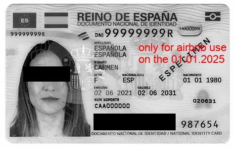
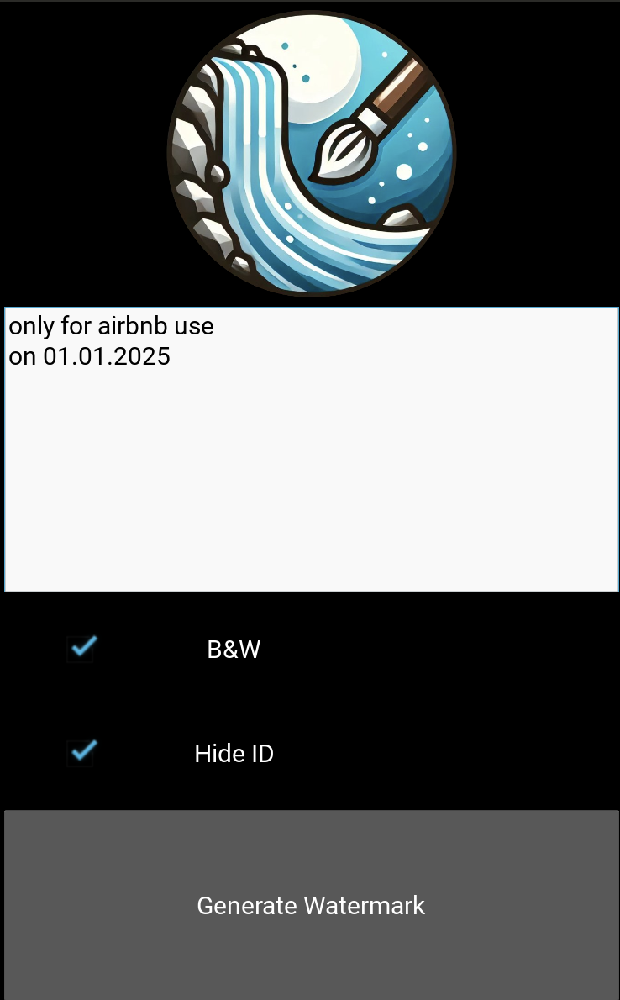

# Watermark
An Android app to easily add watermarks to ID cards

## Motivation

In everyday situations, there are many moments where you may need to send copies of your **identity documents** (e.g., at hotels, car rentals, or for administrative purposes).

Sending **scanned** or **photographed** identity documents comes with risks. It can facilitate **identity theft**, making it easier for anyone to impersonate you. 

A simple solution is to add a small **watermark** to the document, as shown in the image below:

*Source: [Wikipedia](https://es.wikipedia.org/wiki/Documento_nacional_de_identidad_%28España%29) and Watermark* 

There are many ways to add a watermark to a document, but they often have drawbacks:
- Some are **paid services**.
- Some are **complicated** to use and **time-consuming** to learn.
- When using online services, we cannot be sure if they **store** our identity documents.

The goal of this app is to provide a **simple**, **free** solution for adding watermarks to your identity documents quickly and easily, without worrying about **privacy** or **security** issues.

## How to set it up?

## How to use it?
The usage is very simple.

As seen in the image, the user only needs to write the text, select whether they want the resulting image in Black and White (B&W), and choose whether to hide the eyes and signature (Hide ID).
